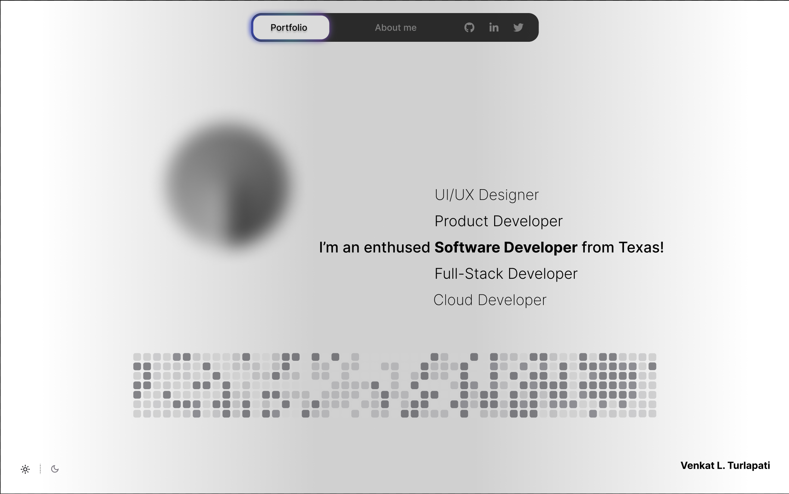
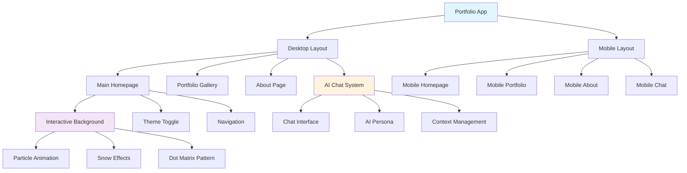
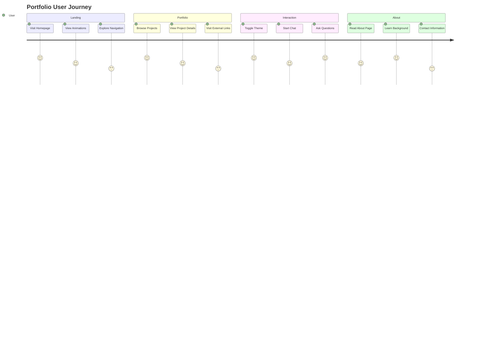
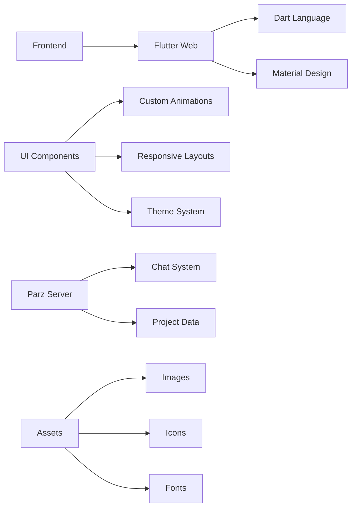

<div align="center">

# Portfolio Website Version 3.0

</div>

[](https://flutter.dev/)
[](https://dart.dev/)
[](https://audienclature.com)
[](LICENSE)
[](pubspec.yaml)
[](https://audienclature.com)

A modern, interactive portfolio website built entirely in Flutter, showcasing software development skills, cloud engineering expertise, and UI/UX design capabilities. Features an AI-powered chat persona, responsive design, and engaging animations.

---

<div align="center">
   <h3></h3>Live at <strong><a href="https://audienclature.com"> audienclature.com</a></strong></h3>
  <p></p>
  
  
  <p><em>Interactive portfolio website with AI chat, responsive design, and modern animations</em></p>
</div>

---

## Architecture Overview



## User Experience Flow



## Key Features

### Core Functionality
- **Responsive Design** - Seamless desktop and mobile experiences
- **Interactive AI Chat** - Personal AI assistant for visitor engagement
- **Portfolio Showcase** - Dynamic project gallery with external integrations
- **Theme System** - Dark/light mode with smooth transitions
- **Modern Animations** - Particle backgrounds, snow effects, and smooth transitions

### Technical Features
- **Flutter Web** - Single codebase for web deployment
- **Adaptive Layouts** - Optimized for different screen sizes
- **Performance Optimized** - Efficient rendering and memory management
- **SEO Friendly** - Proper meta tags and structured data
- **Progressive Enhancement** - Graceful degradation across browsers

## Tech Stack



### Dependencies
- **flutter** - Core framework
- **google_fonts** - Typography system
- **font_awesome_flutter** - Icon library
- **url_launcher** - External link handling
- **http** - API communications
- **flutter_staggered_grid_view** - Advanced grid layouts
- **flutter_linkify** - Automatic link detection

---


## Features Deep Dive

### AI Chat System
- Intelligent conversational AI persona
- Context-aware responses about projects and experience
- Smart suggestion system with balanced question types
- Auto-hiding suggestions after user engagement
- Smooth animations and responsive design

### Portfolio Gallery
- Dynamic project showcase with masonry layout
- External link integration (GitHub, live demos, designs)
- Optimized image loading and caching
- Responsive grid system
- Interactive hover effects

### Theme System
- System-preference detection
- Smooth transition animations
- Consistent color schemes across components
- Persistent theme selection
- Dynamic meta tag updates for browser integration

## Deployment

The portfolio is deployed at **[audienclature.com](https://audienclature.com)** using modern web hosting practices.

### Build Configuration
```yaml
# pubspec.yaml
flutter:
  uses-material-design: true
  assets:
    - assets/
    - web/icons/

artifacts:
  baseDirectory: build/web
  files:
    - '**/*'
```

## Design Reference

The portfolio design was meticulously crafted in Figma, emphasizing modern aesthetics and user experience principles.

**Design System**: [View Figma Design](https://www.figma.com/design/UeixAHUPLTSKiwHR9HVfT2/Portfolio?node-id=0-1&t=QkxcB16bQkJ96mpv-1)


## Browser Support

- Chrome (recommended)
- Firefox
- Safari
- Edge

## Performance Considerations

- Optimized asset loading
- Efficient animation rendering
- Memory-conscious image handling
- Progressive loading strategies
- Minimal bundle size


---

**Built with Flutter** | **Designed for the modern web** | **Deployed at [audienclature.com](https://audienclature.com)**
